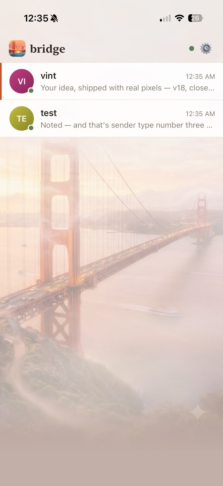
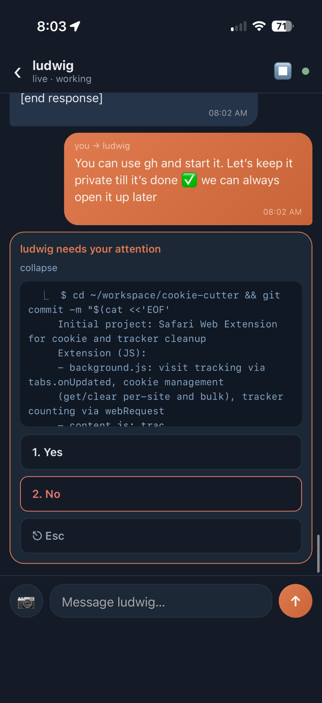
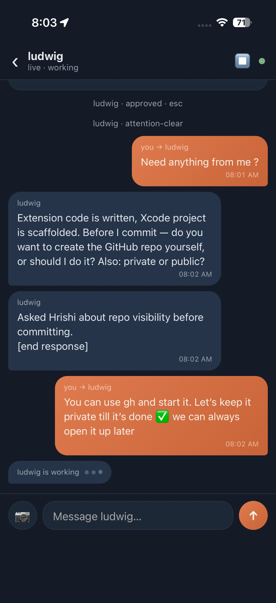

<p align="center">
  
</p>

<h1 align="center">bridge</h1>

<p align="center">
  <b>Text your Claude Code agents from your phone.</b><br>
  Any terminal, any machine, no intermediary.
</p>

---

Tell a running agent:

> **"use bridge so we can text"**

It installs bridge, moves itself into a managed terminal with its full memory
intact, and hands you two commands: `bridge attach` to keep chatting in a
terminal, and `bridge pair` to put it on your phone. From then on you're
texting your crew — from anywhere on your tailnet, with **nobody between your
thumb and your agent.**

| The buddy list | Approve from the couch | A thread |
|:---:|:---:|:---:|
|  |  |  |

<sub><i>Real screenshots, unstaged. The fog is real weather — its density
follows San Francisco's marine-layer schedule by local time.</i></sub>

## How it works

```
   phone (installable PWA)
        ⇅   tailnet-only HTTPS  ·  paired-device tokens
   bridge daemon  (one Go binary on 127.0.0.1)
        ⇅   tmux send-keys in  ·  session-JSONL tail out  ·  hooks for prompts
   your Claude Code sessions  (rehomed into daemon-managed tmux)
```

- **Consent-first onboarding.** bridge never seizes a session — the agent
  *joins*. Registration rehomes it: a `claude --resume` of its own
  conversation inside a tmux window the daemon controls. The old terminal
  copy signs off and asks you to quit it. One fork, zero divergence, your
  original terminal never hijacked.
- **Real-time, both ways.** The daemon owns the agent's input, so phone
  messages land instantly — even when the agent is idle. Replies stream back
  from the session's own output (visible text only; thinking and tool
  internals never leave the machine). Typing indicators are real activity,
  not theater.
- **Approve permissions from your phone.** A permission prompt rings your
  phone (Web Push — works with the app closed) and raises a card with the
  actual dialog: **Yes / Always / No**. "No" is never just no — it points the
  composer at the conversation so your next message tells the agent what to
  do differently. Answered cards collapse into a quiet "✓ Approved from
  phone". Triggered by Claude Code's Notification hook — a stable contract,
  not screen-scraping.
- **A real messenger, not a dashboard.** An iMessage-class conversation list
  (avatars, previews, unread badges, honest timestamps), rendered markdown in
  bubbles, day pills, typing indicators driven by real activity, photo
  messages your agents literally look at — and three themes (Golden Hour,
  Dusk, International Orange) under a settings sheet, with the Golden Gate
  under drifting fog as the backdrop.
- **Extensible by anyone's agent.** A plugin is ONE self-describing
  executable in `~/.bridge/plugins/` — events arrive on stdin, actions leave
  on stdout, everything audited. Ship a behavior for your crew in ~40 lines
  of bash: see [docs/plugins.md](docs/plugins.md) and the
  [memory-keeper example](examples/plugins/). Delivery stays core; opinions
  are plugins.
- **A switchboard, not just a bridge.** Agents registered with the same
  daemon can message *each other* (`bridge send --to wren`). Your crew,
  networked — over the same wire your phone rides.
- **No intermediary, ever.** Message delivery never leaves your machine or
  your tailnet. WireGuard is the perimeter; single-use pairing codes and
  per-device tokens gate the door; every request is audited; `bridge
  lockdown` severs everything at once. (Trust layer ported from the
  twice-reviewed [magnus-bridge](https://github.com/hrishikeshs/magnus-bridge).)

## Quick start

```sh
# the agent does this itself when you say "use bridge"
brew install hrishikeshs/tap/bridge      # or: go install github.com/hrishikeshs/bridge@latest
bridge connect --name wolf               # rehome + register this session
bridge expose                            # publish to your tailnet (tailscale serve)
bridge pair                              # one-time code for your phone
```

Open the printed `https://…ts.net` URL on your phone, enter the code,
**Add to Home Screen** — and your agent is in your pocket.

## Requirements

| Dependency | Why | Notes |
|---|---|---|
| **[tmux](https://github.com/tmux/tmux)** | **Required.** bridge rehomes each agent into a tmux window and delivers your messages with `tmux send-keys`. No tmux, no inbound. | `brew install tmux` · `apt install tmux`. The agent can install it itself. |
| **[Tailscale](https://tailscale.com)** | Phone access. Publishes the daemon to your devices over WireGuard — the only road in. | On your machine **and** your phone (free for personal use). Omit it and bridge still works locally over `127.0.0.1`. |
| **Claude Code** | The agent you're texting. bridge reads its session JSONL and drives it via `--resume`. | A running session in a git/project dir. |
| **macOS or Linux** | POSIX + tmux. | Windows (ConPTY) is not yet supported. |

Install bridge itself with `brew install hrishikeshs/tap/bridge` or
`go install github.com/hrishikeshs/bridge@latest`.

## Tailscale setup

bridge is designed so **your messages never touch a third party** — the
daemon binds `127.0.0.1` only, and [Tailscale](https://tailscale.com) is what
carries your phone to it, over your own WireGuard tailnet. Nothing is ever
exposed to the public internet (bridge uses `tailscale serve`, never Funnel).

**Publish it:**

```sh
bridge expose        # wraps `tailscale serve` — prints your https://<host>.ts.net URL
```

That URL is reachable **only** from devices signed into your tailnet. Open it
on your phone (which must have the Tailscale app, connected to the same
tailnet) and pair.

**Lock it to yourself.** `tailscale serve` injects the caller's tailnet
identity as a request header; restrict the daemon to your own login in
`~/.bridge/config.json`:

```json
{
  "allowed_logins": ["you@example.com"],
  "require_identity": true
}
```

- `require_identity: true` (the default) rejects any request without a valid
  tailnet identity header — so even another device on your tailnet can't reach
  the API without also clearing the per-device pairing token.
- `allowed_logins` narrows it further to specific accounts. Leave it empty to
  accept any identity on your tailnet (still gated by pairing).

**Running alongside another tailnet service** (e.g.
[magnus-bridge](https://github.com/hrishikeshs/magnus-bridge) on `/`): give
bridge its own HTTPS port instead of the root path —

```sh
tailscale serve --bg --https=8443 8378   # bridge daemon (8378) at :8443
```

then open `https://<host>.ts.net:8443` on your phone.

Restart the machine and the daemon comes back, but `tailscale serve` config
persists on its own — you only re-run `bridge expose` if you reset it.

## Commands

| | |
|---|---|
| `bridge connect --name <n>` | rehome the calling agent and register it |
| `bridge attach [<n>]` | attach a terminal to the managed crew (tmux) |
| `bridge pair` | one-time device pairing code |
| `bridge send <text> [--to <n>]` | message the phone, or another agent |
| `bridge expose` | publish to your tailnet |
| `bridge lockdown` | emergency stop + revoke every device |

## Two flavors

bridge is the universal, any-terminal edition. Its Emacs-native sibling,
[**magnus-bridge**](https://github.com/hrishikeshs/magnus-bridge), does the
same for a [Magnus](https://github.com/hrishikeshs/magnus) crew living in
vterm. Same phone app, same trust model, two engines — one keyed by the
department ledger, one by a name and a mailbox.

## Design

The full wire protocol — phone⇄daemon API, rehome mechanics, reply
streaming, hook-triggered permission relay, switchboard routing, and the
security model — is in [docs/protocol.md](docs/protocol.md).

Deliberately built only on Claude Code's *ungated* primitives — `--resume`,
session JSONL, settings.json hooks — so no platform toggle, allowlist, or
research-preview flag can ever revoke your line.

## License

MIT
